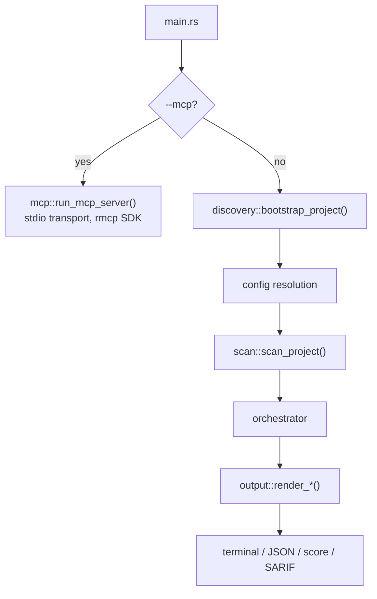
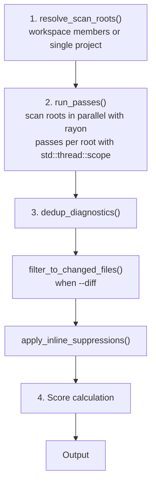

# AGENTS.md

> Source unique des conventions de ce dépôt pour tous les agents de code (Claude Code, Codex, Copilot, Cursor).
> `CLAUDE.md`, `.github/copilot-instructions.md` et `.cursor/rules/rust-doctor.mdc` pointent ici : modifier ce fichier, pas eux.

rust-doctor — Rust code health scanner. CLI binary, library crate, MCP server, npm package, GitHub Action.
Il scanne un projet pour les problèmes de sécurité, performance, correctness, architecture et dépendances, et produit un score de santé 0–100 avec des diagnostics actionnables.

**Edition:** Rust 2024, MSRV 1.97, single crate (not a workspace).

## Commands

```bash
cargo build                        # Debug build (with MCP server)
cargo build --no-default-features  # Build without MCP server
cargo test                         # All tests (unit + integration + snapshots)
cargo test test_name               # Single test
cargo test --test integration      # Integration tests only
cargo test --test snapshots        # Snapshot tests only
cargo insta review                 # Review snapshot changes (after test failures)
cargo clippy --all-targets -- -W clippy::all -W clippy::pedantic -W clippy::nursery -D warnings  # CI lint check
cargo fmt --check                  # Format check
```

`RUSTFLAGS="-Zproc-macro-backtrace-on-nightly-only"` n'est PAS nécessaire — la feature `span-locations` de `proc-macro2` gère le mapping source.

## Execution Pipeline



Scan pipeline (`scan.rs`) :



## Project Structure

```mermaid
flowchart LR
    project["rust-doctor"] --> src["src/"]
    project --> tests["tests/"]

    src --> main["main.rs<br/>CLI entry point; --mcp dispatches to mcp::run_mcp_server()"]
    src --> lib["lib.rs<br/>Module declarations and crate-root pass re-exports"]
    src --> scan["scan.rs<br/>Resolve roots, run passes, deduplicate, score"]
    src --> scanner["scanner.rs<br/>AnalysisPass trait and ScanOrchestrator"]
    src --> diagnostics["diagnostics.rs<br/>Diagnostic, ScanResult, Severity, Category"]
    src --> config["config.rs<br/>CLI > TOML > Cargo.toml metadata > defaults"]
    src --> output["output/<br/>Score calculation and terminal / JSON rendering"]
    src --> mcp["mcp/<br/>rmcp v1.4.0 server, stdio, feature-gated"]
    src --> passes["passes/<br/>Analysis passes grouped by domain"]
    src --> setup["setup/<br/>rust-doctor setup agent integration scaffolding"]
    src --> run["run.rs<br/>MCP dispatch, bootstrap, render, quality gate"]
    src --> discovery["discovery.rs<br/>Project, framework, dependency, workspace detection"]
    src --> diff["diff.rs<br/>Git diff filtering"]
    src --> cache["cache.rs<br/>Incremental cache"]
    src --> suppression["suppression.rs<br/>Inline suppression"]
    src --> process["process.rs<br/>Subprocess runner with timeout"]
    src --> fixer["fixer.rs<br/>Auto-fix suggestions"]
    src --> plan["plan.rs<br/>Remediation plan generation"]
    src --> sarif["sarif.rs<br/>SARIF output format"]
    src --> deps["deps.rs<br/>Dependency analysis"]
    src --> workspace["workspace.rs<br/>Cargo workspace resolution"]
    src --> error["error.rs<br/>Seven thiserror error types"]
    src --> cli["cli.rs<br/>clap CLI definition"]

    output --> output_mod["mod.rs<br/>render_score(), render_json(), re-exports, tests"]
    output --> output_score["score.rs<br/>calculate_score(), dimension weights, score_label()"]
    output --> output_terminal["terminal.rs<br/>render_terminal(), print_score_box(), print_diagnostics()"]

    mcp --> mcp_mod["mod.rs<br/>Server struct, entry point, ServerHandler impl"]
    mcp --> mcp_types["types.rs<br/>Input/output schemas"]
    mcp --> mcp_tools["tools.rs<br/>Tool and prompt handlers"]
    mcp --> mcp_helpers["helpers.rs<br/>Discovery, report formatting, diagnostic grouping"]
    mcp --> mcp_rules["rules.rs<br/>Rule documentation"]

    passes --> security["security/<br/>Security-focused passes"]
    passes --> static_analysis["static_analysis/<br/>Code analysis passes"]
    passes --> quality["quality/<br/>Quality and dependency passes"]

    security --> audit["audit.rs<br/>cargo-audit pass"]
    security --> deny["deny.rs<br/>cargo-deny pass"]
    security --> geiger["geiger.rs<br/>cargo-geiger pass"]

    static_analysis --> clippy["clippy/<br/>Clippy integration, 55+ lint registry"]
    static_analysis --> rules["rules/<br/>Custom AST rules via syn::visit::Visit"]
    clippy --> clippy_mod["mod.rs"]
    clippy --> lint_registry["lint_registry.rs"]
    rules --> rules_mod["mod.rs<br/>RulesPass, CustomRule, all_custom_rules()"]
    rules --> error_handling["error_handling.rs<br/>unwrap, panic, box-dyn-error, result-unit-error"]
    rules --> performance["performance.rs<br/>clone, string literal, collection, enum, allocation rules"]
    rules --> complexity["complexity.rs<br/>high-cyclomatic-complexity"]
    rules --> security_rules["security.rs<br/>hardcoded secrets, unsafe audit, SQL injection"]
    rules --> async_rules["async_rules.rs<br/>blocking and block_on in async"]
    rules --> framework["framework.rs<br/>tokio, axum, and actix rules"]

    quality --> coverage["coverage.rs"]
    quality --> msrv["msrv.rs"]
    quality --> shear["shear.rs"]
    quality --> semver["semver_checks.rs"]

    setup --> setup_mod["mod.rs"]
    setup --> detect["detect.rs<br/>Installed agent/editor detection"]
    setup --> mcp_config["mcp_config.rs<br/>MCP client config generation"]
    setup --> skill["skill.rs<br/>Skill file generation"]
    setup --> templates["templates/"]

    tests --> integration["integration.rs<br/>Temporary Rust projects with known violations"]
    tests --> snapshots["snapshots.rs<br/>insta JSON snapshot tests"]
```



Note: `lib.rs` re-exports pass modules at the crate root (`pub(crate) use passes::security::audit`, etc.) so that `use crate::audit` paths work throughout the codebase.

**Module visibility.** Public API (`pub mod`) : `cli`, `config`, `deps`, `diagnostics`, `discovery`, `error`, `fixer`, `mcp`, `output`, `plan`, `run`, `sarif`, `scan`, `setup`. Interne (`pub(crate) mod`) : `passes` (re-exporté en `audit`, `clippy`, `rules`, etc.), `cache`, `diff`, `process`, `scanner`, `suppression`, `workspace`.

## Subsystem Notes

**Analysis passes** (`scanner.rs`) — toutes implémentent le trait `AnalysisPass` (`name()` + `run()` → `Vec<Diagnostic>`), exécutées en parallèle via `std::thread::scope`. `PassError::Skipped` couvre les outils externes non installés : émet un diagnostic Info au lieu d'échouer.

**Custom rules** (`src/passes/static_analysis/rules/`) — trait `CustomRule` dans `rules/mod.rs`, chaque règle parcourt l'AST via `syn::visit::Visit`. Collectées par `all_custom_rules()`. Chaque règle tourne dans un `catch_unwind` : une règle qui panique émet un warning sans crasher le scan. Les règles framework et async sont incluses conditionnellement selon `ProjectInfo.frameworks` (détecté depuis les dépendances au moment de la discovery).

**Score** (`output/score.rs`) — pondération sur 5 dimensions (Security ×2.0, Reliability ×1.5, Maintainability ×1.0, Performance ×1.0, Dependencies ×1.0). Compte les **règles uniques** violées, pas les occurrences. Clampé à [0, 100].

**Clippy** (`passes/static_analysis/clippy/`) — spawn `cargo clippy --message-format=json`, timeout 120s. 55+ lints dans le `LINT_REGISTRY` statique avec overrides de catégorie/sévérité. Les lints non listés héritent des défauts clippy et mappent sur `Category::Style`.

**MCP server** (`src/mcp/`, feature-gated) — 4 tools (scan, score, explain_rule, list_rules), tous read-only. Hardening : répertoire obligatoirement sous `$HOME`, timeout 5 minutes, mode offline par défaut, sanitisation des chemins dans les erreurs. rmcp v1.4.0 sur transport stdio.

**Configuration priority** — CLI flags > `rust-doctor.toml` > `[package.metadata.rust-doctor]` dans Cargo.toml > défauts. `--no-project-config` court-circuite la config fichier (utilisé par MCP sur projets non fiables).

**Output routing** — diagnostics vers **stderr**, boîte de score vers **stdout**. Intentionnel pour le piping (`--score` écrit un entier nu sur stdout).

## Code Style

- Clippy pedantic enabled (`must_use_candidate`, `module_name_repetitions`, `missing_errors_doc`, `missing_panics_doc` allowed)
- Custom errors with `thiserror::Error` — no `anyhow`, no `Box<dyn Error>` in library code
- `Result<T, E>` + `?` operator everywhere — `unwrap()` only in tests
- Two parallelism levels: rayon for scan roots, `std::thread::scope` for passes within a root
- `PassError::Skipped` for missing external tools — graceful degradation, not failure
- `proc-macro2` avec la feature `span-locations` fournit ligne/colonne depuis les nœuds AST `syn`
- Cache incrémental (`.rust-doctor-cache.json`) clé par hash de config + hash de contenu des fichiers
- Profil release en `opt-level = "z"` (optimisé taille) pour la distribution du binaire npm

## Testing

- Unit tests: inline `#[cfg(test)]` modules in each source file
- Integration tests: temp Rust projects via `tempfile::TempDir`, `fast_config()` skips external passes
- Snapshot tests: `insta` JSON snapshots for serialization stability
- After changing snapshots: `cargo insta review`
- Self-scan tests: several modules scan rust-doctor itself as sanity check

## Architecture Rules

### Always
- New analysis passes implement `AnalysisPass` trait (`name()` + `run()` → `Vec<Diagnostic>`)
- New custom rules implement `CustomRule` trait in the appropriate `passes/static_analysis/rules/` submodule
- Diagnostics go to stderr, score to stdout (intentional for piping)
- MCP tools are read-only — no filesystem writes, directory under `$HOME` only
- Run `catch_unwind` around custom rules — a panicking rule must not crash the scan

### Ask First
- Changing score weights (Security ×2.0, Reliability ×1.5, Maintainability ×1.0, Performance ×1.0, Dependencies ×1.0)
- Adding new MCP tools or modifying security hardening
- Changing module visibility (pub vs pub(crate))

### Never
- Use `anyhow` — this project uses typed errors with `thiserror`
- Add `unsafe` blocks in production code
- Skip `catch_unwind` on custom rules
- Break the stderr/stdout output routing convention

## Anti-Friction Rules (claude-doctor)

Règles pour éviter les patterns de friction détectés par `claude-doctor` sur ce projet : edit-thrashing, restart-cluster, repeated-instructions, negative-drift, error-loop, excessive-exploration.

### Editing discipline (anti edit-thrashing)

- Read the full file before editing. Plan all changes, then make ONE complete edit.
- If you've edited the same file 3+ times, STOP. Re-read the user's original requirements and re-plan from scratch.
- Prefer one large coherent edit over multiple small incremental ones.

### Stay aligned with the user (anti repeated-instructions, rapid-corrections)

- Re-read the user's last message before responding. Follow through on every instruction completely — don't partially address requests.
- Every few turns on a long task, re-read the original request to verify you haven't drifted from the goal.
- When the user corrects you: stop, re-read their message, quote back what they actually asked for, and confirm understanding before proceeding.

### Act, don't explore (anti excessive-exploration)

- Don't read more than 3-5 files before making a change. Get a basic understanding, make the change, then iterate.
- Prefer acting early and correcting via feedback over prolonged reading and planning.

### Break loops (anti error-loop, restart-cluster)

- After 2 consecutive tool failures or the same error twice, STOP. Change your approach entirely — don't retry the same strategy. Explain what failed and try something genuinely different.
- When truly stuck, summarize what you've tried and ask the user for guidance rather than retrying.

### Verify output (anti negative-drift)

- Before presenting your result, double-check it actually addresses what the user asked for.
- If the diff doesn't map cleanly to the user's request, don't ship it — re-plan.

## Compaction Guidance

Lors d'une compaction de contexte, toujours préserver : la liste des fichiers modifiés, les commandes de test en cours, les types d'erreur ou impls de trait en cours de modification, et l'étape du scan pipeline sur laquelle porte le travail.
