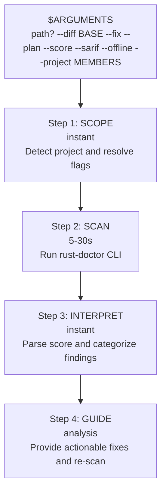

# rust-doctor — Rust Code Health Scanner

Scan target: $ARGUMENTS

## Overview

rust-doctor is a 4-step pipeline that scans Rust codebases for security, performance, correctness, architecture, and dependency issues. It produces a 0-100 health score with dimensional breakdowns and actionable fix guidance.

1. **Scope** — detect project, parse arguments, determine scan mode
2. **Scan** — run `rust-doctor` CLI with appropriate flags
3. **Interpret** — parse score and diagnostics, categorize by priority
4. **Guide** — provide specific fixes for critical findings, re-scan to verify

## Execution Flow



## Runtime Output Format

Before each step, print a progress header:

```
━━━━━━━━━━━━━━━━━━━━━━━━━━━━━━━━━━━━━━━━
[Step N/4] STEP_NAME
━━━━━━━━━━━━━━━━━━━━━━━━━━━━━━━━━━━━━━━━
```

## Step-by-Step Execution

### Step 1 — Scope

Print: `[Step 1/4] SCOPE`

**1a. Parse arguments and determine scan target:**

- If `$ARGUMENTS` contains a path → use it as target directory
- If `$ARGUMENTS` is empty → scan current directory (`.`)
- Extract mode flags from arguments:
  - `--diff [BASE]` → scan only changed files vs base branch (default: auto-detect). Examples: `--diff`, `--diff main`, `--diff develop`
  - `--fix` → apply machine-applicable fixes after scan
  - `--plan` → show prioritized remediation plan (P0-P3)
  - `--score` → quick score only (no detailed diagnostics)
  - `--sarif` → output SARIF 2.1.0 format (for GitHub Code Scanning / GitLab SAST)
  - `--offline` → skip network-dependent checks (advisory DB fetch)
  - `--project <MEMBERS>` → scan only specific workspace members (comma-separated)
  - `--no-project-config` → ignore `rust-doctor.toml` / `Cargo.toml` metadata config

**Note:** `--json`, `--score`, and `--sarif` are mutually exclusive output formats.

**1b. Detect rust-doctor installation:**

Try in order:
1. `rust-doctor --help` (installed via `cargo install rust-doctor`)
2. `npx rust-doctor@latest --help` (installed via npm)
3. `cargo run -- --help` (if inside the rust-doctor repo itself)

If none works, inform the user:
```
rust-doctor not found. Install with:
  cargo install rust-doctor
  # or
  npm install -g rust-doctor
```

**1c. Verify it's a Rust project:**

Check that `Cargo.toml` exists in the target directory. If not, abort with a clear message.

### Step 2 — Scan

Print: `[Step 2/4] SCAN`

**2a. Build the command:**

Base command: `rust-doctor {target} --verbose --json`

Add flags based on Step 1:
- If `--diff` → add `--diff` (or `--diff <BASE>` if a base branch was specified)
- If `--score` → use `--score` instead of `--json` (quick mode — skip to summary)
- If `--sarif` → use `--sarif` instead of `--json` (for CI integration)
- If `--plan` → add `--plan`
- If `--offline` → add `--offline`
- If `--project` → add `--project <MEMBERS>`
- If `--no-project-config` → add `--no-project-config`

```bash
rust-doctor {target} --verbose --json [--diff] [--plan]
```

If `rust-doctor` binary not found, fallback to:
```bash
npx rust-doctor@latest {target} --verbose --json [--diff] [--plan]
```

**2b. Capture output:**

- JSON output goes to stdout → capture and parse
- Diagnostic progress goes to stderr → let it stream for user feedback
- Expected scan time: 5-30s depending on project size

**2c. Handle failures:**

| Error | Action |
|-------|--------|
| Missing `cargo clippy` | Suggest `rustup component add clippy` |
| Missing external tools (cargo-audit, etc.) | Run `rust-doctor --install-deps` to install them |
| Compilation errors | Show errors, suggest fixing compilation first |
| Timeout (>300s) | Report timeout, suggest `--diff` for faster incremental scan |

### Step 3 — Interpret

Print: `[Step 3/4] INTERPRET`

**3a. Parse the JSON output:**

Extract from the scan result:
- **Overall score** (0-100)
- **Dimension scores**: Security, Reliability, Maintainability, Performance, Dependencies
- **Diagnostics list** with: rule ID, severity, message, file:line, category
- **Skipped passes** (tools not installed)
- **Counts**: errors, warnings, info

**3b. Categorize findings by priority:**

| Priority | Criteria | Action |
|----------|----------|--------|
| CRITICAL | Security errors (`hardcoded-secrets`, `sql-injection-risk`, advisory CVEs) | Fix immediately |
| HIGH | Correctness errors (`blocking-in-async`, `block-on-in-async`, `panic-in-library`, `tokio-spawn-without-move`) | Fix before merge |
| MEDIUM | Warnings (`unwrap-in-production`, `unsafe-block-audit`, `excessive-clone`, `large-enum-variant`) | Fix recommended |
| LOW | Info-level findings (`string-from-literal`, style lints, `collect-then-iterate`) | Fix when convenient |

**3c. Display results:**

```
━━━━━━━━━━━━━━━━━━━━━━━━━━━━━━━━━━━━━━━━
RUST-DOCTOR RESULTS
━━━━━━━━━━━━━━━━━━━━━━━━━━━━━━━━━━━━━━━━

**Score:** {N}/100 ({label})
**Security:** {N}/100 | **Reliability:** {N}/100
**Maintainability:** {N}/100 | **Performance:** {N}/100 | **Dependencies:** {N}/100

**Findings:** {N} total — {N} CRITICAL | {N} HIGH | {N} MEDIUM | {N} LOW
**Skipped:** {passes} (install with `rust-doctor --install-deps`)
```

If `--score` mode, stop here with just the score display.

**3d. List findings grouped by priority:**

For each finding, display:
```
[PRIORITY] rule-id — message
  → file:line
```

### Step 4 — Guide

Print: `[Step 4/4] GUIDE`

**Tool selection (adapt to available MCP servers):**

When researching fixes and best practices, use the best tools available:
- **Documentation**: Use Context7 MCP (`resolve-library-id` + `query-docs`) if available for version-accurate docs. Fallback: fetch from docs.rs with WebFetch.
- **Web research**: Use Exa MCP (`web_search_exa`, `get_code_context_exa`) if available for high-quality code search. Fallback: native WebSearch/WebFetch.

**4a. For each finding (CRITICAL and HIGH first):**

- Read the flagged file at the specific line using the Read tool
- Explain WHY it's a problem (not just what was flagged)
- Show the specific code that triggered the finding
- Provide a concrete fix with before/after code
- If unsure about the idiomatic fix, look up the crate docs (Context7 or docs.rs) and search for community patterns (Exa or WebSearch)
- See [references/rules-reference.md](references/rules-reference.md) for fix strategies per rule

**4b. If `--fix` was requested:**

Ask the user for confirmation before applying fixes:
```
Found {N} machine-applicable fixes. Apply them? (CRITICAL: {N}, HIGH: {N}, MEDIUM: {N})
```

After confirmation, apply fixes by editing the flagged files directly.

**4c. Re-scan to verify:**

```bash
rust-doctor {target} --verbose --json [--diff]
```

Compare the new score to the original. Report improvement.

**4d. Summary:**

```
━━━━━━━━━━━━━━━━━━━━━━━━━━━━━━━━━━━━━━━━
SUMMARY
━━━━━━━━━━━━━━━━━━━━━━━━━━━━━━━━━━━━━━━━

**Score:** {before}/100 → {after}/100 ({+/-delta})
**Fixed:** {N} findings
**Remaining:** {N} findings
```

If `--plan` was requested, display the remediation plan:

```
━━━━━━━━━━━━━━━━━━━━━━━━━━━━━━━━━━━━━━━━
REMEDIATION PLAN
━━━━━━━━━━━━━━━━━━━━━━━━━━━━━━━━━━━━━━━━

**P0 — Fix Now** (security/correctness blockers)
- [ ] {rule}: {description} → {file:line}

**P1 — Fix Before Merge** (reliability issues)
- [ ] {rule}: {description} → {file:line}

**P2 — Fix This Sprint** (performance/maintainability)
- [ ] {rule}: {description} → {file:line}

**P3 — Backlog** (informational, style)
- [ ] {rule}: {description} → {file:line}
```

## Hard Rules

1. ALWAYS run `rust-doctor` CLI before providing any guidance — never diagnose from memory.
2. ALWAYS use `--verbose --json` for the scan (unless `--score` quick mode).
3. Read the flagged files before suggesting fixes — understand the context.
4. Re-run after fixes to verify improvement — never claim a fix without verification.
5. Do NOT modify files during interpretation (Step 3) — only in Step 4.
6. Every finding must include file:line and a specific code fix.
7. If `rust-doctor` is not installed, guide the user through installation — do NOT fake results.
8. ASK before applying fixes with `--fix` — show what will change first.

## DO NOT

- Skip the scan and provide generic Rust advice.
- Suggest fixes without reading the actual flagged code.
- Ignore CRITICAL findings to focus on score improvement.
- Run rust-doctor without `--verbose` (insufficient detail for diagnosis).
- Modify unrelated code while fixing flagged issues.
- Invent diagnostics that rust-doctor didn't report.
- Apply fixes without user confirmation.

## Done When

- [ ] `rust-doctor` scan executed with appropriate flags
- [ ] Results parsed and categorized by priority (CRITICAL/HIGH/MEDIUM/LOW)
- [ ] CRITICAL and HIGH findings investigated with file:line context
- [ ] Fixes provided (or applied if `--fix`) for CRITICAL and HIGH findings
- [ ] Re-scan executed to verify improvement (if fixes were applied)
- [ ] Summary displayed with before/after score comparison

## Constraints (Three-Tier)

### ALWAYS
- Run `rust-doctor` before providing any guidance — never diagnose from memory
- Use `--verbose --json` for full diagnostics
- Read flagged files before suggesting fixes — understand the context
- Re-run after fixes to verify improvement
- Include file:line and specific code fix for every finding

### ASK FIRST
- Applying fixes (`--fix`) — show what will change before modifying files
- Installing missing dependencies (`rust-doctor --install-deps`)

### NEVER
- Skip the scan and provide generic Rust advice
- Suggest fixes without reading the actual flagged code
- Ignore CRITICAL findings to focus on score improvement
- Modify unrelated code while fixing flagged issues
- Invent diagnostics that rust-doctor didn't report

## References

- [Rules Reference](references/rules-reference.md) — all 19 custom rules + clippy lints with fix strategies
- [Score Interpretation](references/score-interpretation.md) — dimension weights, score ranges, what each score means
- [Suppression Syntax](references/suppression-syntax.md) — how to suppress specific findings inline
